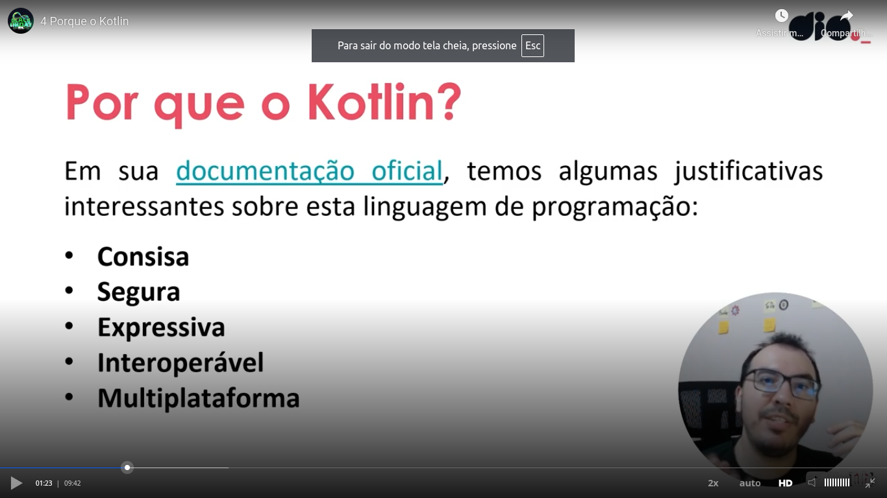
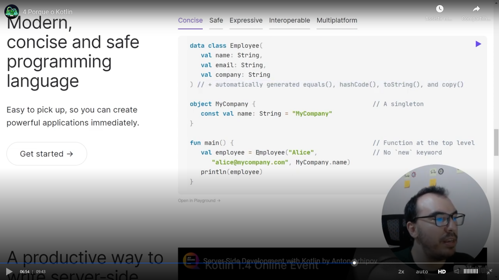
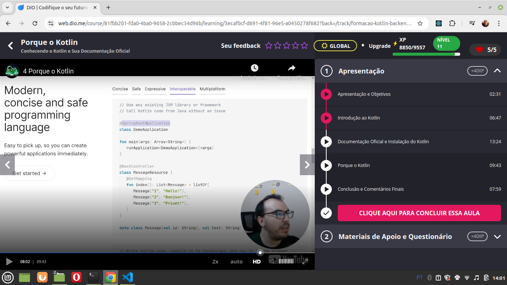

# General

## Comon Kotlin

Teacher talked that [this official Kotlin documentation](https://kotlinlang.org/docs/home.html)is excelent. You can as example that the documentation talks about Kotlin for JavaScript and Kotlin for ASM as example.

He also talked about [Kotlin Playground](https://play.kotlinlang.org/), place where you can try Kotlin code without installing anything.

One observation is that when I developed the [Kotlin version of Jankenpo](https://github.com/andreterceiro/jankenpo-kotlin), I installed the Kotlin tool that generates a JAR file using **apt**.

## Hyper interessant - koans

[Koans](https://play.kotlinlang.org/koans/overview) are challenges of code.

## Github repository

You can see [here](https://github.com/JetBrains/kotlin) the Github repository of Kotlin. Teacher commented that Kotlin is open source.

## Why kotlin

## Examples of official documentation

In the examples of [official Kotlin documentation](https://kotlinlang.org/docs/home.html) you can see examples of how make tests in Kotlin, how to simple create a singleton and a data class, see some examples:

Besides other examples (please see the official documentation for more details), you can see here an example of use of a Spring Framework annotation in Kotlin:

