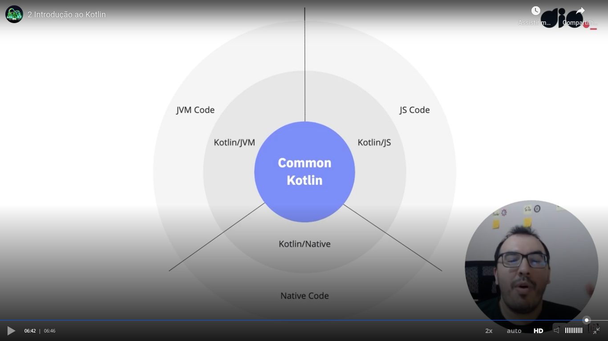

# General

## Comon Kotlin

Teacher talked that [this official Kotlin documentation](https://kotlinlang.org/docs/home.html)is excelent. You can as example that the documentation talks about Kotlin for JavaScript and Kotlin for ASM as example.

He also talked about [Kotlin Playground](https://play.kotlinlang.org/), place where you can try Kotlin code without installing anything.

One observation is that when I developed the [Kotlin version of Jankenpo](https://github.com/andreterceiro/jankenpo-kotlin), I installed the Kotlin tool that generates a JAR file using **apt**.

## Hyper interessant - koans

[Koans](https://play.kotlinlang.org/koans/overview) are challenges of code.